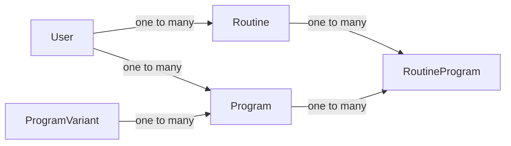
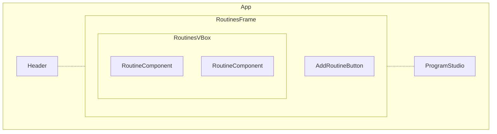
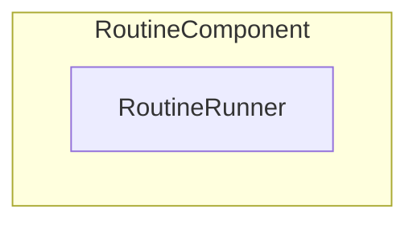
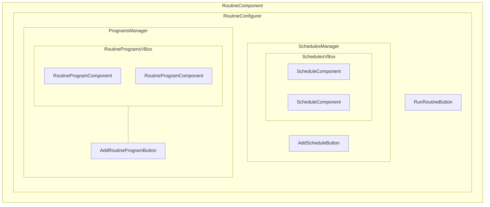
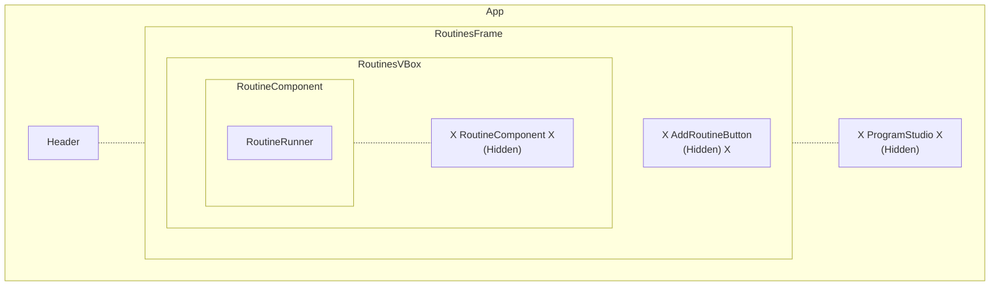
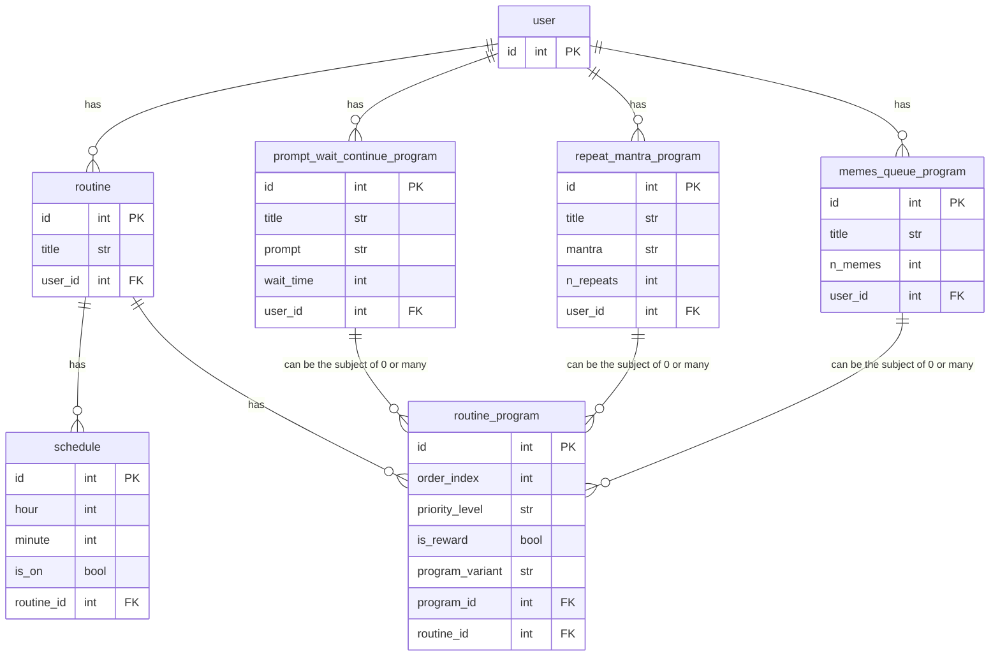

# 🗿 **RoutineBox**

A REMI app that:

- 🥧 is designed to be run "kiosk-style" on a RaspberryPi connected to:

  - 📺 an LCD touchscreen interface

  - 📦 an electro-mechanically operated lockbox

- 🏋️‍♀️ administers user-set routines with incentives (such as unlocking the box)


---

## 🧠 **Core Abstractions Explained**

---

### 1️⃣ **Routine**

- A `Routine` is a collection of `Program`s that are run in a specific order.

### 2️⃣ **Program**

- A `Program` is an interaction between the user and the app that can be anything from `📖` reading the user a chapter of a book to `🚰` prompting them to drink a glass of water, waiting 10s, and waiting for the user to press a button to continue...

### 3️⃣ **ProgramVariant**

- A `ProgramVariant` is a the greater genre or archetype of a `Program`. `Programs` are specific implementations of `ProgramVariants`. For example, a user might create a `Program` to prompt them to drink glass of water, wait 10s, and provide a "continue" button from the `ProgramVariant`, _"PromptWaitContinue."_

### 4️⃣ **RoutineProgram**

- A `RoutineProgram` refers to a `Program`'s role within a `Routine`. A user might assign their `Program`, _"Drink Water"_ to be the second `RoutineProgram` in their `Routine`, _"Morning Routine"_. This means that the `Program` will be run second in the `Routine`.

...

In summary, a user creates `Program`s from `ProgramVariant`s and assigns them to `Routine`s as `RoutineProgram`s:

```mermaid
flowchart LR
    User --creates-.- Routines
    Routines --"made\nup of"-.-  RoutinePrograms
    RoutinePrograms --"which\ndescribe the\nroutine-role\nof"-.-  Programs
    User --creates-.-  Programs
    Programs --"which are\nimplementations\nof"-.-  ProgramVariants
```

We can also visualize these relationships like so:



---

## 📱 **User Interface**

---

From a bird's-eye-view, the UI is organized as follows:



The `RoutineComponent` is the main UI element for a `Routine`. Depending on whether the routine is running or not, It contains either a `RoutineRunner` **OR** a `RoutineConfigurer`.

...

`RoutineComponent`s if the `Routine` **IS** running:



`RoutineComponent`s if the `Routine` is **NOT** running:



Furthermore, when a `Routine` **IS** running, the entire base body of the app is effectively replaced with the single `RoutineRunner` as follows:



---

## 🏃‍♂️ **Regarding the `RoutineRunner`**

---

### 1️⃣ **It instantiates the `Program`-associated UI widgets in order.**

- `ProgramVariant`s are associated with UI widgets that contain the necessary elements for the program's interaction to occur.

- For example, the `ProgramVariant` _"PromptWaitContinue"_ might be associated with a `PromptWaitContinueComponent` which would contain the code to prompt the user do something (like drink a glass of water), wait a number of seconds, and then instantiate a button that the user can press to continue.

- The `RoutineRunner` is responsible for instantiating the `Program`-associated UI widgets that administers the `Program`'s interaction with the user following the order of the `RoutineProgram`s in the `Routine`.

### 2️⃣ **It parameterizes (or omits) programs to try and hit a target routine duration.**

- `ProgramVariant`s might have modifiable parameters (like *how many pages of a book to read*) that can be modified by the `RoutineRunner` in order to try and hit the `Routine`'s `target_duration`.

- `Program`s might be also ommitted altogether to save time if the `RoutineProgram` `priority_level` is set to `"low"`.

---

## 🎁 **Regarding The Incentives**

---

Lastly, the app implements the following in order to incentivize the user to complete routines:

### 1️⃣ **Routines trigger an annoy() method when a `Schedule`-time arrives**

- The annoy method will play a sound on the Raspberry Pi every `interval_seconds` at `volume`.

### 2️⃣ **`ProgramVariant`-associated widgets are provisioned to the `RoutineComponent` when a `RoutineProgram` is completed**

- The `ProgramVariant`-associated widget, in this case, would administer things that the user considers enjoyable or rewarding like a queue of entertaining videos or memes.

---

## ❗💭 **Finally, We Can Illustrate a Hypothetical End-to-End Use Case**

---

👨‍💻 Bob creates a routine and titles it 🌆 `"Evening Routine"`.

👨‍💻 Bob adds a schedule to the routine that triggers the routine `annoy()` method at 9:00 PM. ⏰

👨‍💻 He sets the 🔊 `annoy_volume` to .5 and the `annoy_interval_seconds` ⏱️ to 300 seconds.

...

👨‍💻 Bob then creates a routine and titles it 🌅 `"Morning Routine"`.

👨‍💻 Bob adds a schedule to this routine that triggers the routine `annoy()` method at 7:30 AM. ⏰

👨‍💻 Since he will use this as an alarm ⏰, he sets the `annoy_volume` 🔊 to .9 and the `annoy_interval_seconds` ⏱️ to .5 seconds.

...

👨‍💻 In the `Program Studio` UI component, Bob adds a `PromptWaitContinue` program to his `User` with the following parameters: `prompt="Drink a glass of water"`, `wait_time=10` and names it `"Drink Water"`. 🥛

👨‍💻 He also adds a `RepeatMantra` program to his `User` with the following parameters: `mantra="I am awesome"` 🤩, `n_repeats=10` and names it `"Personal Mantra"`. 💬

👨‍💻 Lastly, he adds a `MemesQueue` program to his `User` with the parameter `n_memes=10` and names it `"Browse Memes"`.

...

👨‍💻  Bob then adds one `RoutineProgram` to his `"Evening Routine"` with the following parameters: `order_index=0`, `priority_level="high"` and selects his `"Personal Mantra"` program 🤩💬.

👨‍💻  He also adds the provided-out-of-the-box `LockTheBox` 🔒 program (to lock his phone in the lockbox) to his `"Evening Routine"` with the following parameters: `order_index=1`, `priority_level="high"`.

👨‍💻  Lastly, he adds his `"Browse Memes"` program to the `Routine`'s `reward_programs` 🎁.

...

👨‍💻  Bob then adds three `RoutineProgram`s to his `"Morning Routine"` with the following parameters:

1. `"Personal Mantra"` 🤩💬 -- `order_index=0`, `priority_level="high"`
2. `"Drink Water"`🥛 -- `order_index=1`, `priority_level="high"`
3. `"Personal Mantra"` 🤩💬 -- `order_index=2`, `priority_level="low"`

👨‍💻  He then adds the provided-out-of-the-box `UnlockTheBox` 🔓 program the `Routine`'s `reward_programs` 🎁 to get his phone for the day.

...

👨‍💻 Lastly, he sets the `target duration` of his `"Evening Routine"` to 2 minutes and the `target duration` of his `"Morning Routine"` to 5 minutes.

...

Now, `RoutineBox` and Bob are ready to go! 🚀

🌆 At 9:00 PM, `RoutineBox` will annoy 👨‍💻 Bob with a sound 🔊 every 5 minutes until he completes his `"Evening Routine"` (which includes locking his phone 📱 in the lockbox). On completion, he will be rewarded 🎁 with a queue of memes.

🌅 In the morning at 7:30 AM, `RoutineBox` will annoy 👨‍💻 Bob with a sound 🔊 every .5 seconds until he completes his `"Morning Routine"`. If it takes him longer than 5 minutes, the second `"Personal Mantra"` program will be omitted since the `RoutineProgram`'s `priority_level` is `"low"`. On completion, he will be rewarded 🎁 with the unlocking of his phone 📱 from the lockbox. 📦

---

## 📝 **Theorized Domain Model/DB Schema of Example**

---


