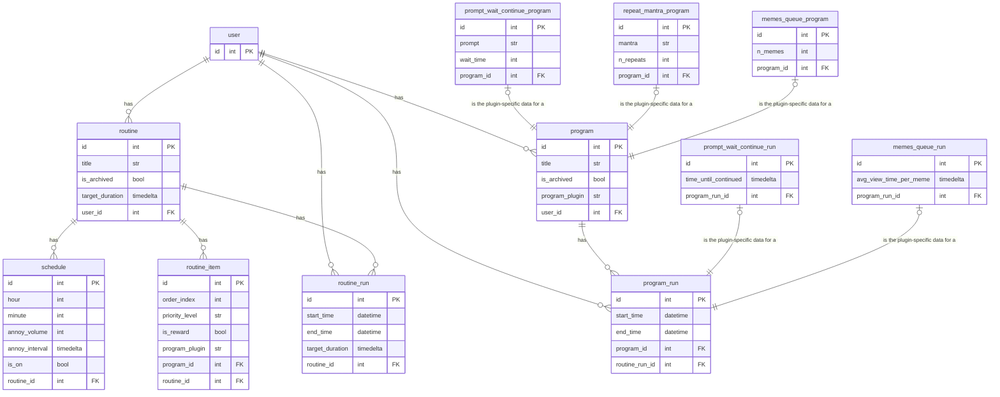

# Eduardo-Sonny Consultation

## 🚀 **1.** Understand the App I am Trying to Build, Its Use-Case, and the Problem it Solves

### 👾 **1.1** What is the App?

`RoutineButler` is an app that:

- 🥧 is designed to be run "kiosk-style" on a RaspberryPi connected to:

  - 📺 an LCD touchscreen interface

  - 📦 an electro-mechanically operated lockbox

- 🏋️‍♀️ administers user-set routines with incentives (such as unlocking the box)

### 👾 **1.2** Who would use it?

First and foremost, the app is for my own use (I have already built raspberry-pi+lockbox+touchscreen kiosk setup).

Nevertheless, I am trying to take into consideration the possibility that other people might want to use this app someday as well.

### 👾 **1.3** What does it do?

The app allows users to:

- 📝 configure routines
- 📝 configure programs
- 💪 have routines administered to them
- 🔒 lock their phone away as an incentive to complete routines

### 👾 **1.4** What are the main abstractions of the app?

#### 1️⃣ **Routine**

- A `Routine` is a collection of `Programs` that are run in a specific order.

#### 2️⃣ **Program**

- A `Program` is an interaction between the user and the app that can be anything from `📖` reading the user a chapter of a book to `🚰` prompting them to drink a glass of water, waiting 10s, and waiting for the user to press a button to continue...

#### 3️⃣ **ProgramPlugin**

- A `ProgramPlugin` is a the greater genre or archetype of a `Program`. `Programs` are specific implementations of `ProgramPlugins`. For example, a user might create a `Program` to prompt them to drink glass of water, wait 10s, and provide a "continue" button from a `ProgramPlugin` titled, `PromptWaitContinue`. Some other Program plugins could include: `RepeatMantra`, which could be configured into a program by specifying a mantra (`str`) and the number of times you'd want it read aloud the mantra aloud to you... or `MemesQueue`, which someone might configure to be a "reward" program for a routine, etc.

#### 4️⃣ **RoutineItem**

- A `RoutineItem` refers to a `Program`'s role within a `Routine`. A user might assign their `Program`, _"Drink Water"_ to be the second `RoutineElement` in their `Routine`, _"Morning Routine"_. This means that the `Program` will be run second in the `Routine`.

...

In summary, a user creates `Programs` from `ProgramPlugins` and then allocates them to `Routines` as `RoutineItems`.

...

Here is my idea for the data model / domain model / ERD so far:

- **NOTE:** "PromptWaitContinue", "RepeatMantra", and "MemesQueue" are just placeholder `ProgramPlugins` to help illustrate the idea... I might or might not implement them as suggested in the diagram... However, everything else is how I actually envision it as of now.

### 👾 **1.5** What does using the app actually look like in practice?

...

👨‍💻 Bob creates a routine and titles it 🌆 `"Evening Routine"`.

👨‍💻 Bob adds a schedule to the routine that triggers the routine `annoy()` method at 9:00 PM ⏰ and sets the 🔊 `annoy_volume` to .5 and the `annoy_interval_seconds` ⏱️ to 300 seconds.

...

👨‍💻 Bob creates another routine and titles it 🌅 `"Morning Routine"`.

👨‍💻 Bob adds a schedule to this routine at 7:30 AM. ⏰

👨‍💻 Since he will use this `annoy()` as his morning alarm ⏰, he sets the `annoy_volume` 🔊 to .9 and the `annoy_interval_seconds` ⏱️ to .5 seconds.

...

👨‍💻 Bob creates a `PromptWaitContinue` program with the following parameters: `prompt="Drink a glass of water"`, `wait_time=10` and titles it `"Drink Water"`. 🥛

👨‍💻 He also creates a `RepeatMantra` program with the following parameters: `mantra="I am awesome"` 🤩, `n_repeats=10` and titles it `"Personal Mantra"`. 💬

👨‍💻 Lastly, he adds a `MemesQueue` program to his `User` with the parameter `n_memes=10` and names it `"Browse Memes"`.

...

👨‍💻  Bob then adds a single `RoutineItem` to his `"Evening Routine"` 🌆 with the following parameters: `order_index=0`, `priority_level="high"` and selects his `"Personal Mantra"` program 🤩💬.

👨‍💻  He also adds the provided-out-of-the-box `LockTheBox` 🔒 program (to lock his phone in the lockbox) to his `"Evening Routine"` 🌆 with the following parameters: `order_index=1`, `priority_level="high"`.

👨‍💻  Lastly, he indicates that the `"Browse Memes"` `RoutineItem` is a reward program for the `Routine`. 🎁

...

👨‍💻  Bob then adds three `RoutineItem`s to his `"Morning Routine"` 🌅 with the following parameters:

1. `"Personal Mantra"` 🤩💬 -- `order_index=0`, `priority_level="high"`
2. `"Drink Water"`🥛 -- `order_index=1`, `priority_level="high"`
3. `"Personal Mantra"` 🤩💬 -- `order_index=2`, `priority_level="low"`

👨‍💻  He then indicates that the provided-out-of-the-box `UnlockTheBox` 🔓 program is a `reward_program` 🎁  for the `Routine` (to get his phone for the day).

...

👨‍💻 Lastly, he sets the `target_duration` of his `"Evening Routine"` to 2 minutes and the `target_duration` of his `"Morning Routine"` to 5 minutes.

...

Now, `RoutineButler` and Bob are ready to go! 🚀

🌆 At 9:00 PM, `RoutineButler` will annoy 👨‍💻 Bob with a sound 🔊 every 5 minutes (300 seconds) until he completes his `"Evening Routine"` (which includes locking his phone 📱 in the lockbox 📦). Once he completes the routine, he will be rewarded 🎁 with a queue of memes.

🌅 In the morning at 7:30 AM, `RoutineButler` will annoy 👨‍💻 Bob with a sound 🔊 every .5 seconds until he completes his `"Morning Routine"`. If it takes him longer than 5 minutes, the second `"Personal Mantra"` program will be omitted since the `RoutineItem`'s `priority_level` is `"low"`. Once he completes the routine, he will be rewarded 🎁 with the unlocking of his phone 📱 from the lockbox. 📦

...

## 🚀 **2.** Once You Feel Like You Understand the Idea Behind My App, Help Me With the Following:

### 👾 **2.1** How does my data model / domain model / ERD look?

- Does it look like a good way to accomplish my goals?

- Do you think I should rethink anything?

- I have been building with `SQLite3` and the `SQLModel` ORM so far.

- My plan is to have the `SQLite3` DB exist on a thumb drive inserted into the Raspberry Pi with a daily program that backs it up to a cloud storage service (probably Google Drive).

- I plan on adding new `ProgramPlugins` for years to come. So I would theoretically need to add 2 new tables (one for its programs and one for its program's runs) every time I add a new one. Not too bad, but if I have 10+ program plugins (which is likely to happen some day in the future), I'll have a whole lot of tables... MEANING, I should maybe consider a different ORM (or no ORM at all) + `MongoDB`... **Let's chat about this!**

- I am building it as a web app with `NiceGUI` under the theory that even though the back _and_ front ends are running on the Raspberry Pi (I don't want it to _depend_ on an internet), I could open a port to my local network and access it from my phone or laptop too.

### 👾 **2.2** Once we've decided on the best way to store the data, I would like to set up a CRUD-style wrapper for the DB and build all the necessary tests (with mocking the DB) to make sure it works

- If we go with a relational database in which I have to create a new table for every new `ProgramPlugin`, I would like the suite of tests to be dynamic to the number of `ProgramPlugins` in the app (I.E. it collects all the `ProgramPlugin` classes and uses something like pytest's `parametrize` to have the DB tests run for all of them)... In fact, just as a general principle, I would like everything about the app to be dynamic to the number of `ProgramPlugins` so that I can add/remove them without much workload overhead.

- It might even be an interesting topic of discussion to have `ProgramPlugins` be their own Github repos that `RoutineButler` pip-installs and imports...

## 🚀 Of Course, This is All "As Time Permits"

I am not expecting you to do everything of course. I am just looking for you to assess the situation and inject your expertise where you think it will be the most helpful given our general time constraints. In other words, you can provide help in any format you find prudent:

- A list of things you think I should do to make my app better
- Partial code implementations of things as you would do them (I can finish them)
- etc.

Altogether, I really think it boils down to:

1. Helping me solidify my **data model**/how I will store the data (relational vs. non-relational)

2. Helping me get off in the right direction with the CRUD-style wrapper for the DB and the tests for it

3. Any other general advice regarding system design or repo (repos?) structure for the plugin system...

...I will share the private repo with you on GH soon!

...Also, if you would recommend dockerizing the app...
