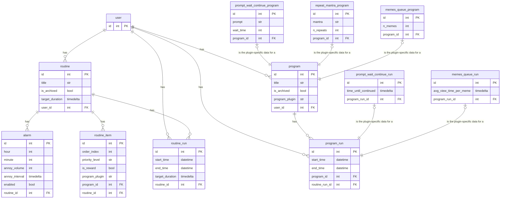

# RoutineButler

## 🚀 **1.** Understand the App I am Trying to Build, Its Use-Case, and the Problem it Solves

### 👾 **1.1** What is the App?

`RoutineButler` is an app that:

- 🥧 is designed to be run "kiosk-style" on a RaspberryPi connected to:

  - 📺 an LCD touchscreen interface

  - 📦 an electro-mechanically operated lockbox

- 🏋️‍♀️ administers user-set routines with incentives (such as unlocking the box)

### 👾 **1.2** Who would use it?

First and foremost, the app is for my own use (I have already built raspberry-pi+lockbox+touchscreen kiosk setup).

Nevertheless, I am trying to take into consideration the possibility that other people might want to use this app someday as well.

### 👾 **1.3** What does it do?

The app allows users to:

- 📝 configure routines
- 📝 configure programs
- 💪 have routines administered to them
- 🔒 lock their phone away as an incentive to complete routines

### 👾 TODO

- [ ] change nomenclature of routine_items to elements
- [ ] make elements a json field in routine (and not own table) where order is inferred from the order of the json list

### Old ERD Diagram

Here is my idea for the data model / domain model / ERD so far:

- **NOTE:** "PromptWaitContinue", "RepeatMantra", and "MemesQueue" are just placeholder `ProgramPlugins` to help illustrate the idea... I might or might not implement them as suggested in the diagram... However, everything else is how I actually envision it as of now.
