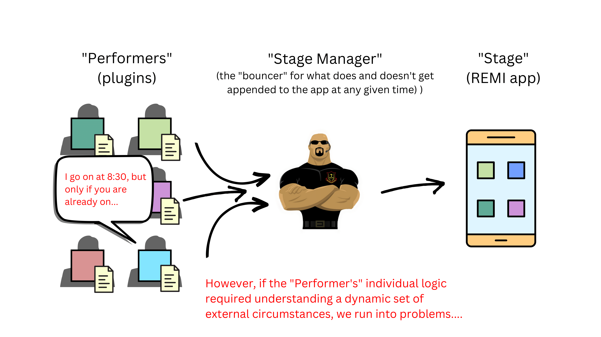

# 🚀 Cassius

```python
╔═════════════════════════════════════════════════════════════╗
║ .▄████▄. .▄▄▄ . . . .██████ . ██████ .██░ █▓. .██ . ██████. ║  
║ ▒██▀ ▀█. ▒████▄ . .▒██ . .▒ ▒██. .▒▒ ░██░ ██. ░██░ ██▒ . ▒. ║ 
║ ▒▓█. . ▄ ▒██. ▀█▄ .░ ▓██▄ . ░ ▓██▄ . ▒██░.██. ▒██░. ▓██▄. . ║ 
║ ▒▓▓▄ ▄██▒░██▄▄▄▄██ . ▒ .░██▒. ▒ .░██▒░██░░▓█. ░██░. ▒ .░██▒ ║
║ ▒ ▓███▀ ░ ▓█ . ▓██▒▒██████▒░.██████▒▒░██░░▒█████▓ ▒██████▒▒ ║
║ ░ ░▒ ▒ .░ ▒▒ . ▓▒█░▒ ▒▓▒ ▒░░▒ ▒▓▒ ▒ ░░▓. ░▒▓▒ ▒ ▒ ▒ ▒▓▒ ▒ ░ ║
║ . .░ ▒ .▒ . ▒▒ ░░ ░▒. ░. ▒░░▒ .░.░ ▒.░░░▒░ ░ ░ ░ ░▒ ░░ ░░ . ║
║ ░. . . . . ░ . ▒. .░ .░. ░░ ░ .░. ░ . ▒ ░ ░░░ ░ ░ ░ ░░ .░ . ║ 
║ ▒ ░. . .░. . . ░. ░. . . ░. . . . ░ . ░ . . ░ . . . ░. .░ . ║
╚═════════════════════════════════════════════════════════════╝ 
```

## TODO

- [ ] Change nomenclature of ORM models to be the entities themselves (without "Model" suffix) and change the components to have "Component" suffix if 1-1 with orm entity
- [ ] Seperate models into their own files
- [ ] Add new/delete schedule buttons in RoutineConfigurer
- [ ] Is their a way to async the database i/o? ... perhaps some sort of caching to help performance?
- [ ] Add "program" entities to the app: two very simple ones could be "readtext" and "promptcontinue"
- [ ] Add functionality to check for actively scheduled routines and run them with alarm sound at beginning
- [ ] Document everything with doc strings, mermaid diagrams, etc.
- [ ] Get a full-on, paid code review from one or more relevant people

## ❓ About

This repo currently exists to help me test and plan the theory behind the "kiosk-style" app that I will run on my raspberry pi and use to accomplish a variety of tasks including but not limited to:

- entertainment (limited watching of videos, etc.)
- controlling mechanical devices such as a lockbox for downtime from electronics
- other interactive sub-apps such as: computer-vision-monitored physical exercise, personal study tools like flashcards, etc.


## 📈 Current Goal

Come up with a way to effectively modularize sub-apps such that:

1. They are self-contained
2. They are self-governed
3. My main app code does not need to know anything about them.

## 📉 Current Status

I have successfully written an app structure that seems to accomplish the current goal.

However, I would like to improve the code/strategy/design pattern to the extent possible.

## 💻 Running the app

- Clone the repo
- Navigate to the repo directory
- Create the necessary Python virtual environment using the `Makefile` commands:

```bash
make venv
make activate
make install
```

- Run the app with either of the following commands:

```bash
python3 app.py
```

or

```bash
make run
```

## 💃🏯 Theater Analogy

The app is currently written with naming that corresponds to the following analogy:




Short question:

How do you vary the naming of data model classes and functional classes that correspond to the same thing? Is there a convention? Is there a way to make them the same class?

Long question:

If I have an app where any given user has an indeterminate number of "X” modules (like say maybe how a user has non-fixed number of posts or something), and in my code, I have an “X” class that contains all of the actual functionality for the module…

```python
class X:
    def __init__(self):
        ...
    def do_stuff(self):
        ...
```

I want the database to store the necessary unique attributes for their “X” modules, so that when they re-open the app, it will retrieve this information and instantiate their “X” objects.

My current idea is to create a database-corresponding data model class for “X” module that the “X” Class would contain and manage. However, I am struggling with what I would name this class since the name “X” is already taken ("XAttrs"? "XConfigs”? “XData"?)… You’d imagine that the table in DB would simply be named “X” after the module that it serializes… So it feels strange having a deviant naming for the corresponding dataclass in my code…

```python
class XAttrs:
    """Data model for X module attributes--could be Pydantic/SQLModel/etc."""
    characteristic_1: str
    characteristic_2: int
    ...

class X:
    def __init__(self, attrs: XAttrs):
        self.attrs = attrs
    def do_stuff(self):
        ...
```

I’m certain this is a situation that others have encountered. How might I approach this?