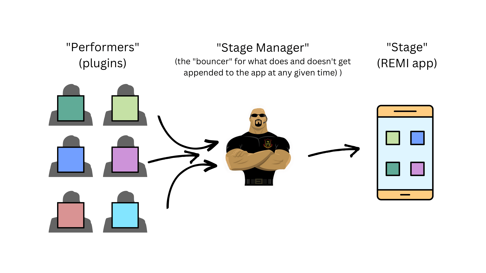
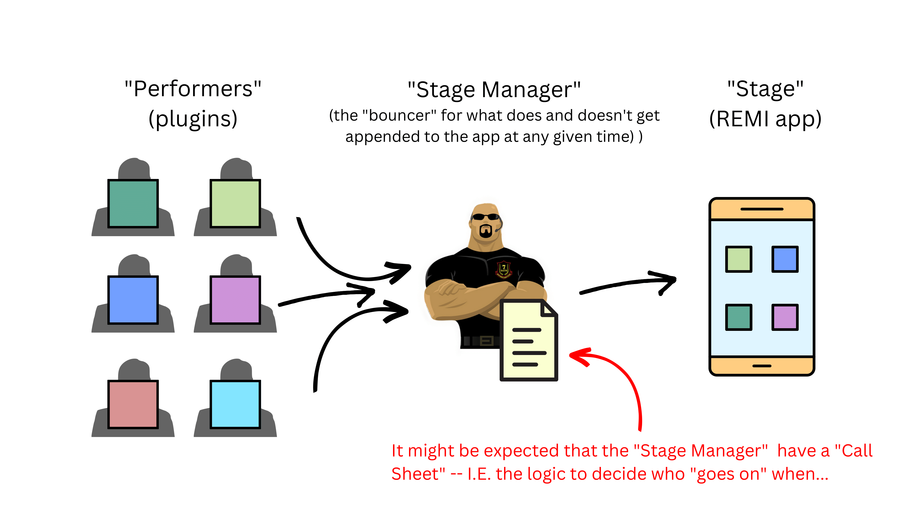
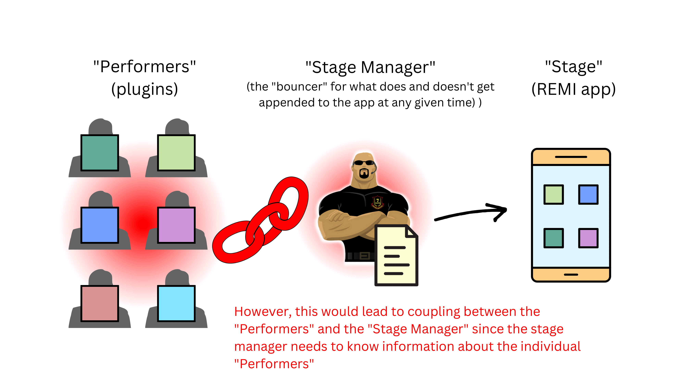
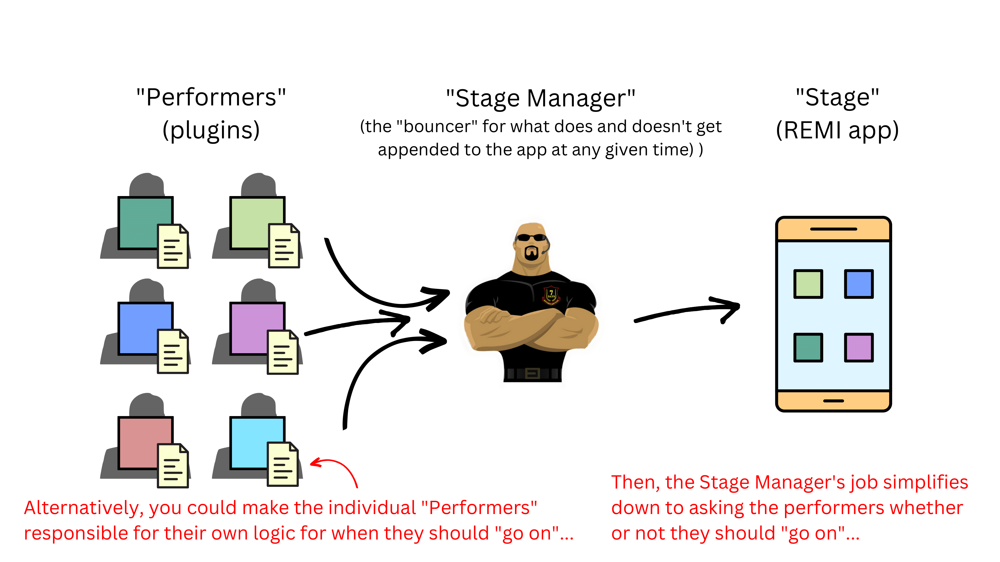

# README.md

## About

This repo currently exists to help me test and plan the theory behind the "kiosk-style" app that I will run on my raspberry pi and use to accomplish a variety of tasks.

## Current Goal

Come up with a way to effectively modularize sub-apps such that:

1. They are self-contained
2. They are self-governed
3. My main app code does not need to know anything about them.

## Current Status

I have successfully written an app structure that seems to accomplish the current goal.

However, I would like to improve the code/strategy/design pattern to the extent possible.

## Running the app

- Clone the repo
- Navigate to the repo directory
- Create the necessary Python virtual environment using the `Makefile` commands:

```bash
make venv
make activate
make install
```

- Run the app with either of the following commands:

```bash
python app.py
```

or

```bash
make run
```

## Theater Analogy

The app is currently written with semantic naming that corresponds to the following theater analogy:





