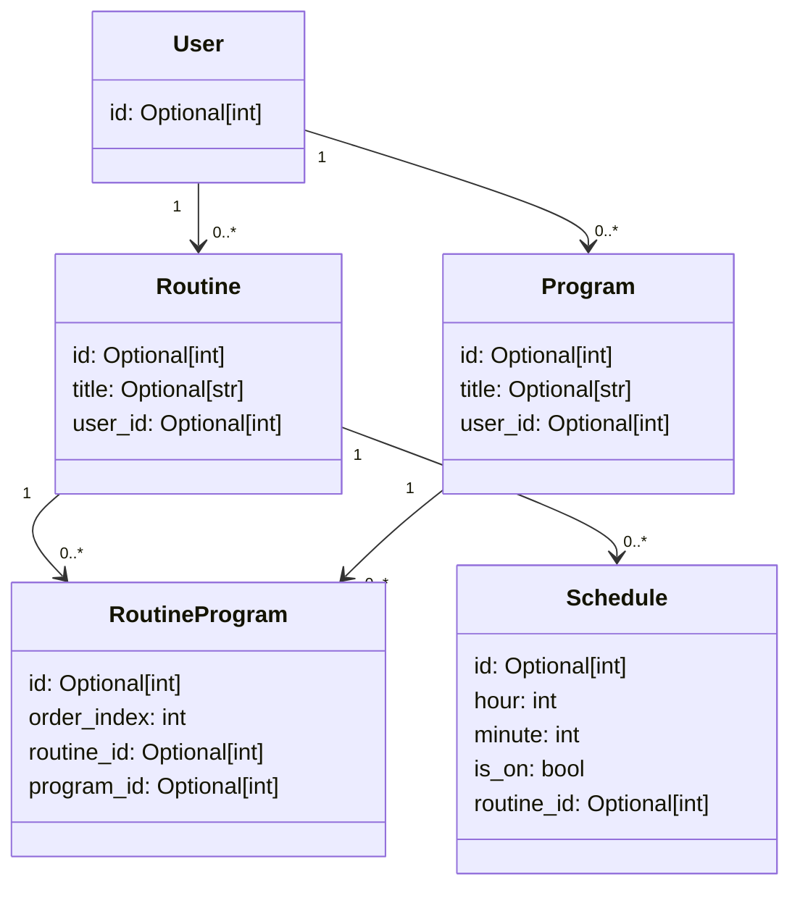

# 🚀 Cassius

```python
╔═════════════════════════════════════════════════════════════╗
║ .▄████▄. .▄▄▄ . . . .██████ . ██████ .██░ █▓. .██ . ██████. ║
║ ▒██▀ ▀█. ▒████▄ . .▒██ . .▒ ▒██. .▒▒ ░██░ ██. ░██░ ██▒ . ▒. ║
║ ▒▓█. . ▄ ▒██. ▀█▄ .░ ▓██▄ . ░ ▓██▄ . ▒██░.██. ▒██░. ▓██▄. . ║
║ ▒▓▓▄ ▄██▒░██▄▄▄▄██ . ▒ .░██▒. ▒ .░██▒░██░░▓█. ░██░. ▒ .░██▒ ║
║ ▒ ▓███▀ ░ ▓█ . ▓██▒▒██████▒░.██████▒▒░██░░▒█████▓ ▒██████▒▒ ║
║ ░ ░▒ ▒ .░ ▒▒ . ▓▒█░▒ ▒▓▒ ▒░░▒ ▒▓▒ ▒ ░░▓. ░▒▓▒ ▒ ▒ ▒ ▒▓▒ ▒ ░ ║
║ . .░ ▒ .▒ . ▒▒ ░░ ░▒. ░. ▒░░▒ .░.░ ▒.░░░▒░ ░ ░ ░ ░▒ ░░ ░░ . ║
║ ░. . . . . ░ . ▒. .░ .░. ░░ ░ .░. ░ . ▒ ░ ░░░ ░ ░ ░ ░░ .░ . ║
║ ▒ ░. . .░. . . ░. ░. . . ░. . . . ░ . ░ . . ░ . . . ░. .░ . ║
╚═════════════════════════════════════════════════════════════╝
```

## TODO

- [ ] Change name of a "Program"?
- [ ] Change RoutineProgram to ProgramInRoutine?
- [ ] Add a target-minutes field to the routine model and routine configurer
- [ ] Make more things drop-downs? Make the programs / schedules drop downs?
- [ ] Have no mutables as defaults outside of __init__ methods
- [ ] Make trash buttons actually call parental delete and get rid of idle checking
- [ ] Trashable base class? Inheriting two models at once?
- [ ] Put UI settings into central UI configs file
- [ ] Somehow implement an abc of protocol to more formally/logistically enforce models to have an id primary key
- [ ] pre-commit hooks
- [ ] Get DB Wrapper roasted?
- [ ] Seperate models into their own files
- [ ] Add "program" entities to the app: two very simple ones could be "readtext" and "promptcontinue"
- [ ] Add functionality to check for actively scheduled routines and run them with alarm sound at beginning
- [ ] Document everything with doc strings, mermaid diagrams, etc.
- [ ] Get a full-on, paid code review from one or more relevant people

## ❓ About

This repo contains the WIP "kiosk-style" app that I will run on my raspberry pi and use to accomplish a variety of tasks including but not limited to:

- entertainment (limited watching of videos, etc.)
- controlling mechanical devices such as a lockbox for downtime from electronics
- other interactive sub-apps such as: computer-vision-monitored physical exercise, personal study tools like flashcards, etc.


## 📉 Current Status

I have successfully written an app structure that seems to accomplish the current goal.

Currently working toward an MVP that I will use as an alarm clock and perhaps get formally code reviewed.

## Current Domain Model


